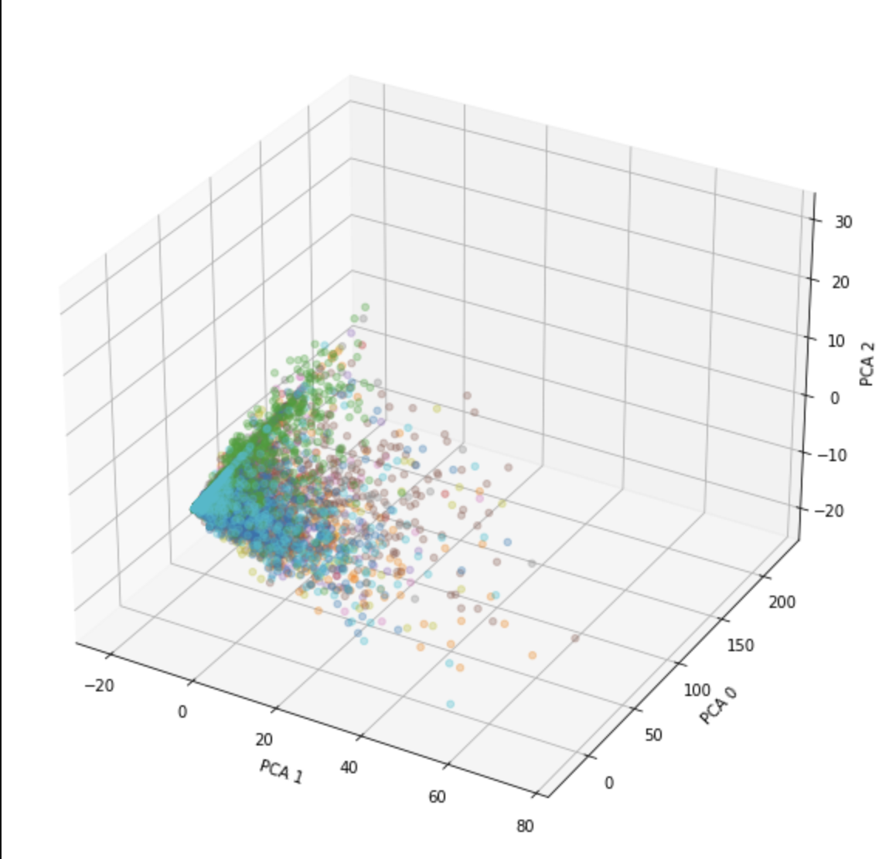
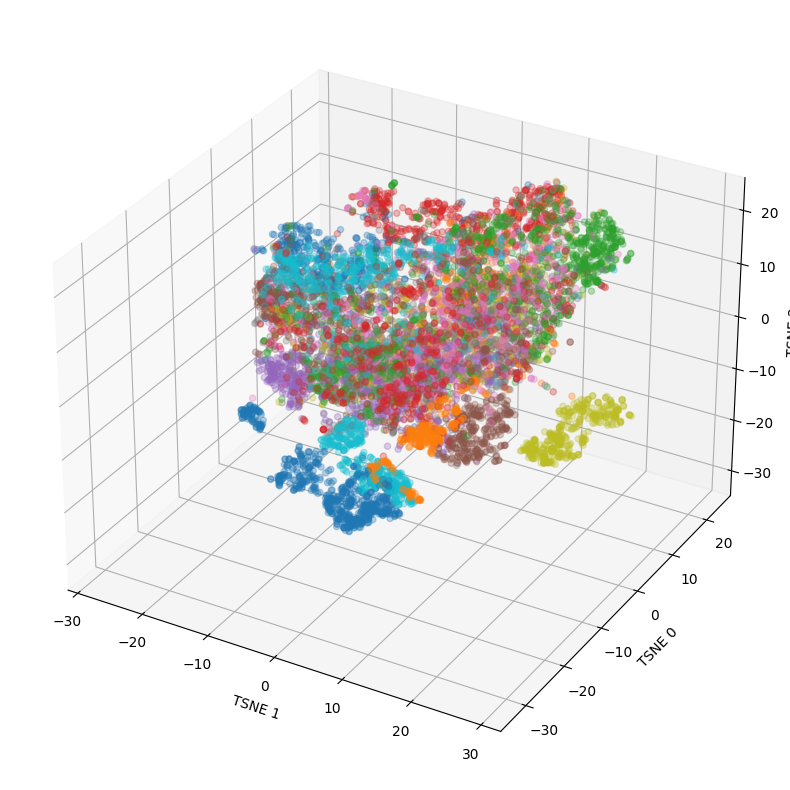

# HackING23
### Document Recognition & Classification Proof Of Concept
Hackaton HackING 2023 - Project repository for team EMjoyers

### Methodology
We approached the subject with hope to go multimodal:
- NLP Engine with OCR text input, getting the essential meaning from the documents
- CV Engine analysing the visual structure of the document

We found however, that the OCR input was highly unreliable. Here we can see the PCA analysis explaining around 90% of variance within the BoW constructed from top-50 words present within each class (with overlap):

Thus with time constrains, instead of back-engineering the text, we decided to focus solely on the CV aspect. 

The data was not sufficient to train a network from scratch. We've opted for looking at some easily-accessible open-source models. Thus we looked for ImageNet pretrained model, to extract feature-embeddings from.
The model needed to allow for some translational invariance, but at the same time, had to recognise space-specific placements of some sections of documents. 
We opted for Vision Transformer (ViT) with hope, that the positional encoding does not only retain the dependence in between the patches, but passes the knowledge of specific placement to higher-level features.

We've loaded all transformer-encoded layers from ImageNet-pretrained ViT-B16 implemented at https://github.com/faustomorales/vit-keras

We then embedded both the train and test set and classified them using a two-layer neural network. 

Since our data is black-and-white, we duplicated the values onto 3 channels to match ImageNet input.

Here we can see the TSNE analysis of image embeddings from vision transformers. As you can see, most classes are inseparable.

We opted for manual cleaning of the training dataset. After this, we finally achieved 69% mean cross validation accuracy, with 99% accuracy in regards to some classes (usually the ones with most normalized, quality data).

### Authors
Team EMjoyers: 
    Julia Jakubowska, Rafał Kaczmarek, Agata Kulesza, Łukasz Niedźwiedzki, Weronika Skibicka

Project was created as a part of HackING 2023 hackaton. More info at 
https://challengerocket.com/hacking
